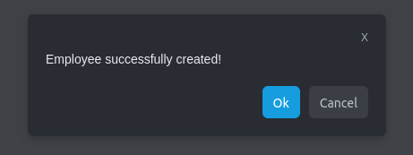

# simple-react-modal-plugin

Modal dialog component for ReactJS.



## Installation

To install, you can use [npm](https://npmjs.org/) or [yarn](https://yarnpkg.com):

```shell
$ npm i simple-react-modal-plugin
$ yarn add simple-react-modal-plugin
```

To use simple-react-modal-plugin in a React app:

- In a react app, import the component:

```javascript
import { HrnetModal } from "simple-react-modal-plugin"
```
- To setup the component's state, add:

```javascript
const [openModal, setOpenModal] = useState(false)
```

To use the component's state, pass it as prop:

```javascript
<HrnetModal setOpen={setOpenModal} />
```

- To custom the composant (...or not), take a look below and add what you need with props:

```javascript
<HrnetModal
    open={openModal}
    setOpen={setOpenModal}
    // Customization
    title={''}
    titleColor={''}
    message={hrnetModalMessage}
    // ...
/>
```

## Usage

You can use it like a simple React component in your React project

```javascript
import { HrnetModal } from "./lib"

const [openModal, setOpenModal] = useState(false)

{
    <HrnetModal
        setOpen={setOpenModal}
        // Set your Props here to custom the component //
    />
}
```

## Props

| Props                    | Type      | Description                                                      |
| :---------------------   | :-------- | :----------------------------------------------------------------|
| `open`                   | `boolean` | `if true, the modal is shown and hidden if false`                |
| `setOpen`                | `boolean` | `toggle the state of the modal - set openModal to true or false` |
| `title`                  | `string`  | `title of your modal (i.e 'Hello world')`                        |
| `titleColor`             | `string`  | `color value of your modal's title (i.e '#0000FF')`              |
| `message`                | `string`  | `message of your modal (i.e 'Welcome')`                          |
| `backdropBg`             | `string`  | `color value of your page background (i.e '#ffffff')`            |
| `modalBg`                | `string`  | `color value of your modal's background (i.e '#ffffff')`         |
| `xCloseColor`            | `string`  | `color value of the x close (i.e '#ffffff')`                     |
| `modalWidth`             | `string`  | `width value of your modal (i.e '400')`                          |
| `okButton`               | `boolean` | `true ou false if you want an ok button`                         |
| `okButtonColor`          | `string`  | `color value of the button text (i.e '#ffffff')`                 |
| `okButtonColorHover`     | `string`  | `color value of the button text on hover (i.e '#ffffff')`        |
| `okButtonBg`             | `string`  | `color value of the button background (i.e '#ffffff')`           |
| `okButtonBgHover`        | `string`  | `color value of the button background on hover (i.e '#ffffff')`  |
| `okButtonAction`         | `string`  | `Dispatch a function on submit`                                  |
| `cancelButton`           | `boolean` | `true ou false if you want a cancel button`                      |
| `cancelButtonColor`      | `string`  | `color value of the button text (i.e '#ffffff')`                 |
| `cancelButtonColorHover` | `string`  | `color value of the button text on hover (i.e '#ffffff')`        |
| `cancelButtonBg`         | `string`  | `color value of the button background (i.e '#ffffff')`           |
| `cancelButtonBgHover`    | `string`  | `color value of the button background on hover (i.e '#ffffff')`  |

## Exemple

Here is  a simple example of simple-react-modal-plugin being used:

```javascript
import { HrnetModal } from "simple-react-modal-plugin"
import { useState } from "react"
import styled from 'styled-components'

export default function App() {
    const [openModal, setOpenModal] = useState(false)
    const [isHover, setIsHover] = useState(false)
    const handleMouseEnter = () => setIsHover(true)
    const handleMouseLeave = () => setIsHover(false)
    const handleModal = () => setOpenModal((toggle) => !toggle)
    const handleOkButtonAction = () => console.log('Dispatch a function on submit')

    const hrnetModalMessage = 'Employee successfully created!'

    return (
        <BodyMain>
            <HomeButton
                style={{
                    backgroundColor: isHover ? '#25b3f5' : '#169de0'
                }}
                onClick={(e) => handleModal(e)}
                onMouseEnter={handleMouseEnter}
                onMouseLeave={handleMouseLeave}
            >
                Open modal
            </HomeButton>

            <HrnetModal
                open={openModal}
                setOpen={setOpenModal}
                title={''}
                titleColor={''}
                message={hrnetModalMessage}
                backdropBg={'rgba(15,19,26,.8)'}
                modalBg={'#292d33'}
                xCloseColor={'#a4a9b3'}
                modalWidth={'400'}
                okButton={true}
                okButtonColor={'#fff'}
                okButtonColorHover={'#fff'}
                okButtonBg={'#169de0'}
                okButtonBgHover={'#25b3f5'}
                okButtonAction={handleOkButtonAction}
                cancelButton={true}
                cancelButtonColor={'#a4a9b3'}
                cancelButtonColorHover={'#e9ebf0'}
                cancelButtonBg={'transparent'}
                cancelButtonBgHover={'#5c6066'}
            />
        </BodyMain>
    )
}

const BodyMain = styled.main`
    margin: 20vh auto;
    text-align: center;
`
const HomeButton= styled.button`
    align-items: center;
    border: none;
    border-radius: 6px;
    color: #fff;
    cursor: pointer;
    display: inline-flex;
    font-size: 14px;
    font-weight: 400;
    justify-content: center;
    line-height: 20px;
    margin-bottom: 0;
    overflow: hidden;
    padding: 8px 12px;
    position: relative;
    text-align: center;
    text-decoration: none;
    transition: color .15s ease-out;background-color .15s ease-out;
    user-sselect: none;
    vertical-align: middle;
    white-space: nowrap;
`
```